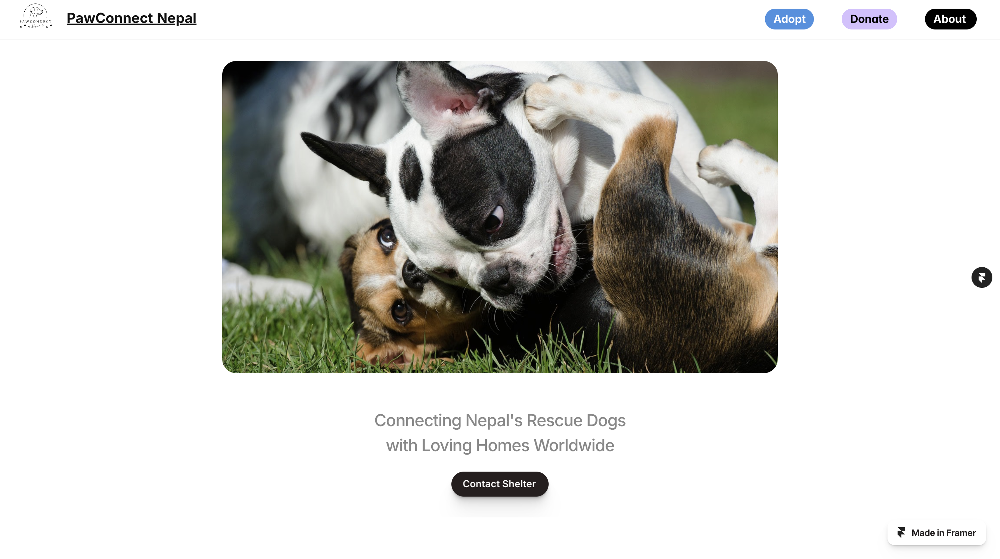
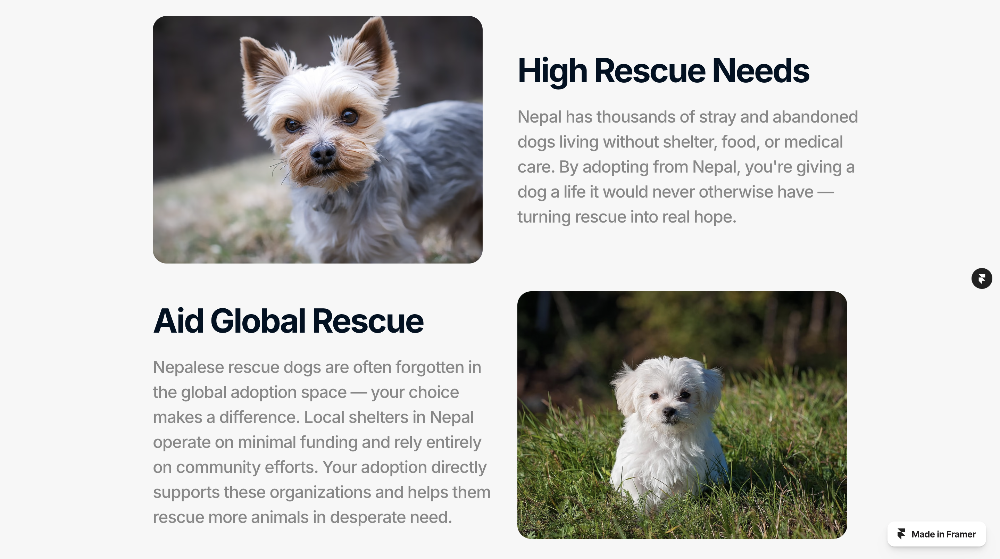
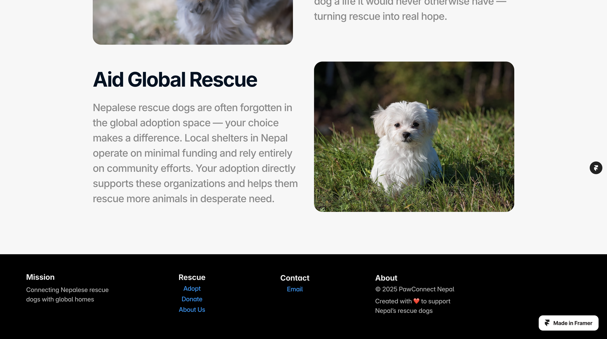
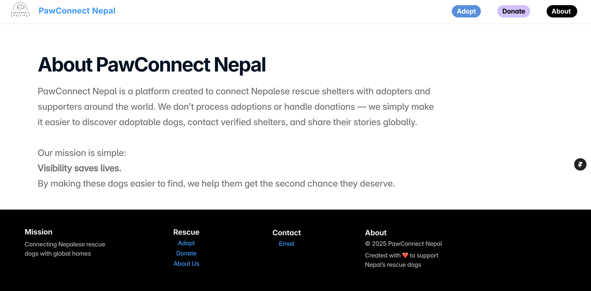
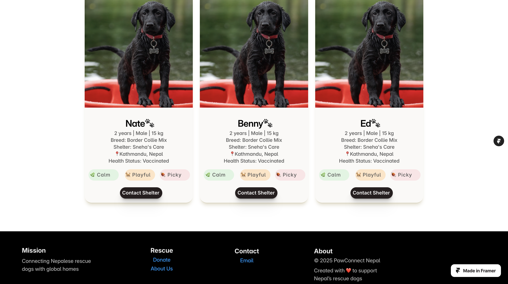
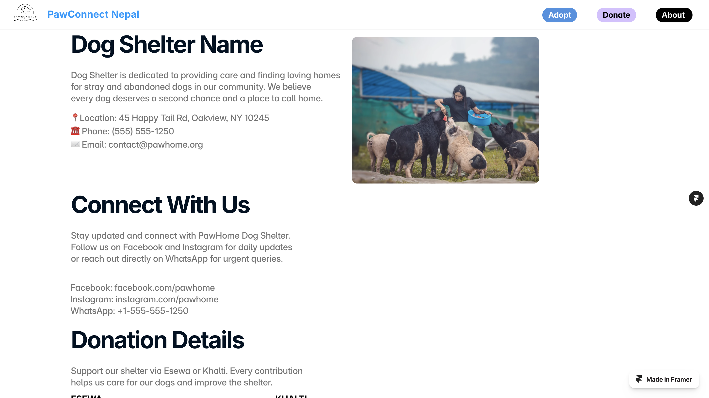
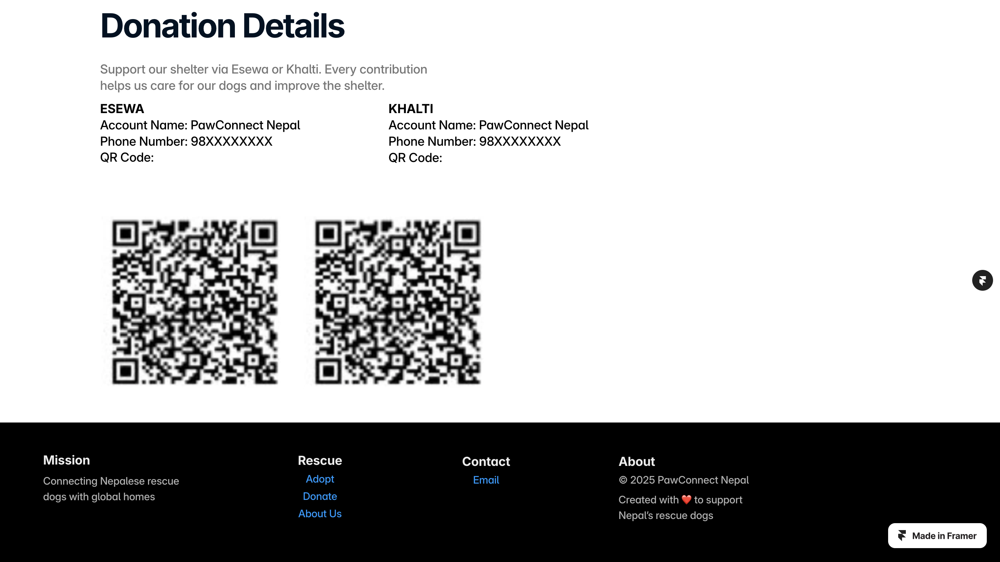

# 🐾 PawConnect Nepal

**PawConnect Nepal** is a personal mission-driven project to help rescue dogs from Nepal find loving homes across the globe — while supporting local shelters through better visibility and easier donation flows.  
Built with love as a dog parent and product builder, this platform reflects my passion for solving meaningful problems at the intersection of technology, design, operations, and social impact.

---

## 💻 What I Built and Managed

- Ran local and international user surveys to uncover adoption and donation friction points  
- Defined key user journeys and product goals from research insights  
- Designed a responsive, mobile-first UX using Framer (no-code)  
- Created a dog–adopter matching interface with contact pathways  
- Integrated donation flows (eSewa + Khalti) with transparency in mind  
- Developed onboarding workflows to support individual shelter pages  
- Built modular UI to scale dogs and shelters easily across the platform  

---

## 🌱 Current Status

I'm actively reaching out to local shelters and onboarding them.  
This is an evolving platform — the long-term goal is to sustainably expand the reach, bring more shelters online, and help more dogs find their forever homes.

---

## 🔗 Live Site

👉 **Website:** [https://pawconnectnepal.framer.website/](https://pawconnectnepal.framer.website/)  
📦 **GitHub:** You’re already here :)

---

## 💛 Why It Matters

This project is about using simple technology to create real-world impact — for the dogs, the shelters, and the people who care.

## 📸 Screenshots

Here’s a quick look at the platform in action:

### 🐶 Homepage

### 🏠 Shelter List Page

### About Page

### Adopt Page

### Donate Page

### 📱 Mobile View
